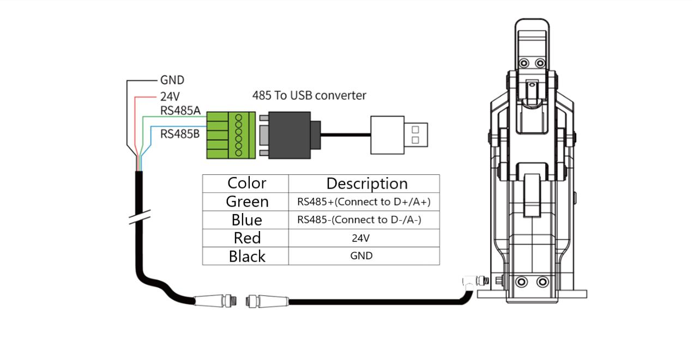

# pyDHgripper: Control DH Gripper with Python

[EN] | [[中文]](docs/README_cn.md)

## Description

PyDHgripper is a Python library that allows you to control the DH gripper with Python. The DH gripper is a kind of robot gripper. It is widely used in the field of robot control. This project is based on the Modbus protocol of the DH gripper. The types of DH gripper controlled with this library includes AG-95, DH-3, and PGE series.

## Hardware Requirements

- DH gripper
- USB-to-RS485 converter
- 24V DC power supply

Here is a connection example for AG-95 gripper

<div align=center></div>

## Installation

The `pyDHgripper` library supports Python 2.x and Python 3.x. You can install the library using the following command:

```bash
git clone https://github.com/han-xudong/pyDHgripper.git
cd pyDHgripper
pip install pip -U
pip install -r requirements.txt
```

## Quick Start

For Linux, it's needed to set the serial port permission first:

```bash
sudo chmod 777 /dev/ttyUSB0
# For CTS-B1.0,
# sudo chmod 777 /dev/ttyACM0
sudo usermod -aG　dialout {userName}
reboot
```

Here are three types of DH grippers that can be controlled with `pyDHgripper`. For example, to control the AG-95 gripper:

```python
from pyDHgripper import AG95

gripper = AG95(port='/dev/ttyUSB0')
```

And here are some functions that can be used to control the gripper:

- `read_state`: Read the state of the gripper.

```python
gripper.read_state()
```

- `read_pos`: Read the position of the gripper.

```python
gripper.read_pos()
```

- `set_force`: Set the force of the gripper.

```python
gripper.set_force(val='{FORCE}')
```

- `set_pos`: Set the position of the gripper.

```python
gripper.set_pos(val='{POSITION}')
```

- `set_vel`: Set the velocity of the gripper.

```python
gripper.set_vel(val='{VELOCITY}')
```

For more functions, please refer to the source code.

## Documentation

Here `pyDHgripper` provide user manuals for the DH grippers, including AG-95, DH-3, and PGE series.

[AG Gripper Short Manual (Modbus-RTU)](docs/AG_Gripper_Short_Manual_Modbus-RTU_v2.3.pdf)

[DH-3 Short Manual](docs/DH-3_Short_Manual_v2.pdf)

[PGE Series Product Operation Manual](docs/PGE_Series_Internal_Controller_Short_Manual_v3.1.pdf)

## License and Acknowledgement

PyDHgripper is licensed under the MIT License.

Some core codes are developed based on [DaHuan-FingerControl](https://github.com/FrankJIE09/DaHuan-FingerControl) by Frank.

The DH grippers are developed by DH Robotics. For more information, please refer to the [DH Robotics website](http://en.dh-robotics.com/).
