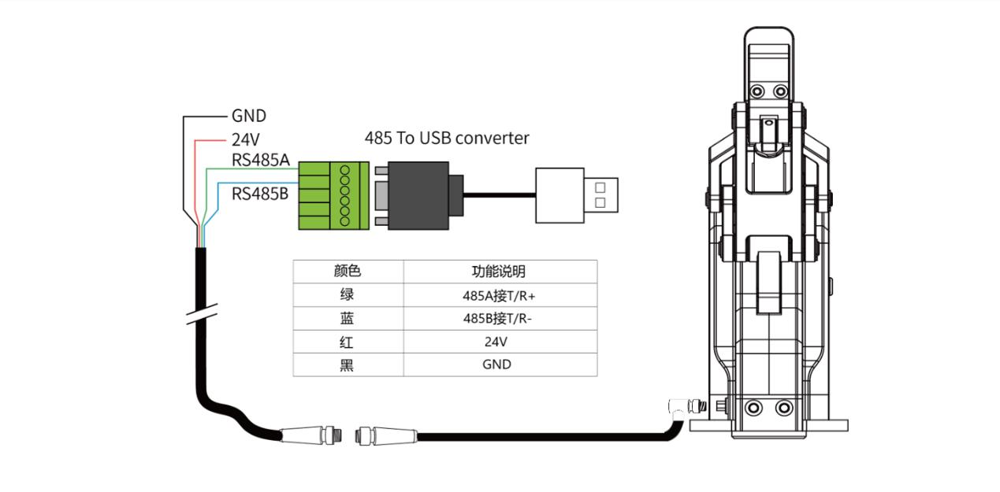

# pyDHgripper: 使用Python控制DH夹爪

[[EN]](../README.md) | [中文]

## 描述

PyDHgripper是一个Python库，允许你用Python控制[DH夹爪](https://www.dh-robotics.com/)。DH夹爪是一种广泛应用于机器人领域的机器人夹爪。该项目基于Modbus通信协议，可以控制的DH夹爪类型包括AG-95、DH-3、RGD和PGE系列。

## 硬件要求

- DH夹爪
- USB转RS485模块
- 24V直流电源

以下是以AG-95夹爪为例的接线：

<div align=center></div>

## 安装

`pyDHgripper`库支持Python 2.x和Python 3.x。你可以使用以下命令安装该库：

```bash
git clone https://github.com/han-xudong/pyDHgripper.git
cd pyDHgripper
pip install pip -U
pip install -r requirements.txt
```

## 快速开始

对于 Linux，首先需要设置串行端口权限：

```bash
sudo chmod 777 /dev/ttyUSB0
# 对于通信盒，sudo chmod 777 /dev/ttyACM0
sudo usermod -aG dialout {userName}
reboot
```

多种DH夹爪可以用 `pyDHgripper`控制。例如，要控制AG-95夹爪：

```python
from pyDHgripper import AG95

gripper = AG95(port='/dev/ttyUSB0')
```

这里有一些可以用来控制夹爪的函数：

- `read_state`：读取夹爪的状态。

```python
gripper.read_state()
```

- `read_pos`：读取夹爪的位置。

```python
gripper.read_pos()
```

- `set_force`：设置夹爪的力。

```python
gripper.set_force(val='{FORCE}')
```

- `set_pos`：设置夹爪的位置。

```python
gripper.set_pos(val='{POSITION}')
```

- `set_vel`：设置夹爪的速度。

```python
gripper.set_vel(val='{VELOCITY}')
```

更多函数，请参考源代码。

## 文档

`pyDHgripper`提供了多个夹爪的操作说明，包括AG-95、DH-3、RGD和PGE系列:

[AG系列操作说明书](AG系列操作说明书_MODBUS_v2.6.pdf)

[DH-3操作说明书](DH-3操作说明书_CAN_v1.1.pdf)

[RGD系列产品操作手册](RGD系列产品操作手册_v2.1.pdf)

[PGE系列驱控一体式产品操作手册](PGE系列驱控一体式产品操作手册_v3.2.pdf)

## 许可证和致谢

PyDHgripper采用MIT许可证。

核心代码是在Frank的[DaHuan-FingerControl](https://github.com/FrankJIE09/DaHuan-FingerControl)基础上开发的。

DH夹爪由大寰机器人（DH Robotics）开发。有关更多信息，请参阅[大寰机器人（DH Robotics）网站](http://www.dh-robotics.com/)。
